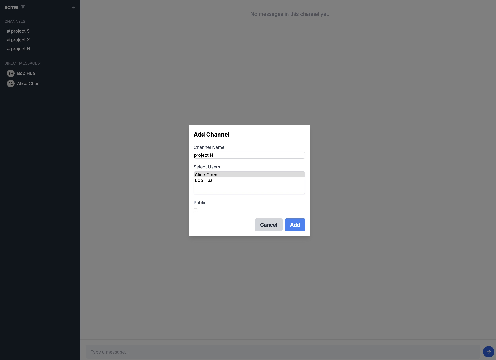

# Chatapp 作业：

1. 添加 add channel 或者跟 workspace 里其他人进行 direct message
2. 添加对 channel update / new 的 SSE 支持（自动刷新 sidebar 下的 channel list）
    * 场景：alice 发起一个新的 channel，把 bob, tyr 添进群聊，bob tyr 应该得到通知，更新 sidebar


sse 收到消息
```
message:"{\"event\":\"NewChat\",\"id\":12,\"wsId\":1,\"name\":\"project N\",\"type\":\"privateChannel\",\"members\":[1,2],\"createdAt\":\"2024-09-06T05:29:29.362921Z\"}"
```

